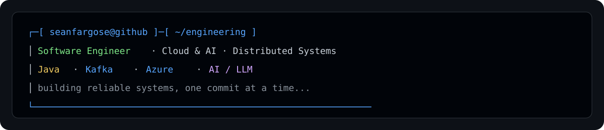

<picture>
  <source media="(prefers-color-scheme: dark)" srcset="./assets/dark_mode.svg">
  <source media="(prefers-color-scheme: light)" srcset="./assets/light_mode.svg">
  
</picture>

# SEAN FARGOSE

### Software Engineer · Cloud & AI · Distributed Systems

`Mumbai, India` · `Backend Engineering` · `Azure` · `AI / LLMs`

---

## 👨‍💻 About Me

I'm a Software Engineer focused on **backend engineering, cloud infrastructure, distributed systems, and AI-powered applications**.

Currently working on enterprise Azure infrastructure and cloud transformation while building systems around **Java, Spring Boot, Apache Kafka, cloud cost intelligence, and AI/LLM engineering**.

My interests sit at the intersection of:

`☁️ Cloud` · `⚙️ Backend` · `🔄 Distributed Systems` · `🤖 AI`

---

## 🧠 Core Skills

<table>
<tr>
<td width="50%" valign="top">

### Languages

`Java` · `Python` · `C` · `C++` · `SQL` · `TypeScript`

### Backend

`Spring Boot` · `Spring WebFlux` · `REST APIs`  
`Apache Kafka` · `Project Reactor` · `WebSockets`  
`Redis` · `PostgreSQL` · `MongoDB`

### Architecture

`Distributed Systems`  
`Microservices`  
`Event-Driven Architecture`  
`Reactive Programming`

</td>

<td width="50%" valign="top">

### Cloud

`Microsoft Azure` · `AWS` · `GCP`

`Azure DevOps` · `Azure VMware Solution`  
`Azure Migrate` · `VMware HCX`

### DevOps

`Docker` · `Kubernetes` · `Terraform`  
`CI/CD` · `Linux` · `Git/GitHub`

### AI / LLM

`Claude API` · `Claude Code`  
`Model Context Protocol (MCP)`  
`Azure AI` · `Prompt Engineering`  
`Applied ML Research`

</td>
</tr>
</table>

---

## 🛠️ Technologies

---

# 🚀 Featured Projects

## ☁️ AI-Powered Cloud Cost Intelligence Platform

**Azure · AWS · GCP · Next.js · TypeScript · Node.js · PostgreSQL · Redis · WebSockets · MCP · Claude**

AI-powered cloud cost intelligence platform providing **real-time cost analytics, anomaly detection, forecasting, and optimization recommendations**.

### Highlights

- Built a modular backend with **5 AI analysis workflows**
- Designed domain-oriented REST APIs
- Implemented Redis caching and WebSocket subscriptions
- Added request validation, rate limiting, compression, and centralized error handling
- Built a dedicated **MCP server** integrating Azure Cost Management APIs with Claude
- Implemented structured tool interfaces and response validation
- Added confidence scoring, token tracking, and retry handling
- Modeled **247 subscriptions**
- Modeled **52K+ cloud resources**
- Simulated **$15M annual cloud spend**
- Identified **$8.8K in modeled savings opportunities**

---

## ⚡ Real-Time Wikipedia Analytics Pipeline

**Java · Spring Boot 3.5 · Spring WebFlux · Apache Kafka · Project Reactor · Micrometer · Prometheus**

Real-time streaming analytics platform consuming the **Wikimedia live edit feed** through an event-driven architecture.

### Highlights

- Built decoupled Spring Boot producer and consumer services
- Consumed Wikimedia's live SSE stream using Project Reactor
- Implemented Kafka-based event processing
- Built thread-safe aggregation using `LongAdder` and `ConcurrentHashMap`
- Achieved approximately **3,510 events/minute**
- Processed **60,000+ events** in a continuous run
- Achieved **sub-second update latency**
- Diagnosed and fixed **4 production-blocking defects**
- Identified a Kafka serializer/deserializer mismatch silently dropping consumed messages
- Restored throughput from **0 → 3,500+ events/minute**
- Added Micrometer, Prometheus, and Spring Boot Actuator monitoring

---

# 💼 Experience

### Software Engineer · Capgemini

`September 2025 — Present` · `Mumbai, India`

Working on enterprise Azure infrastructure and cloud transformation.

**Azure Infrastructure**

- Managing enterprise Azure environments spanning **100+ subscriptions**
- Working across Resource Groups, Storage Accounts, Azure SQL Databases, and Virtual Machines
- Executing Azure DevOps pipelines for infrastructure provisioning and lifecycle management
- Implementing Entra ID, RBAC, PIM, Service Principals, Key Vault, and AD Groups
- Supporting monitoring, capacity management, disaster recovery, and production operations

**Cloud Migration**

- Migrated **76 of 108 VMware virtual machines** to Azure VMware Solution
- Designed and configured VMware HCX migration infrastructure
- Worked with HCX Connector, Site Pairing, Network Profiles, Compute Profiles, and Service Mesh
- Executed Bulk Migration, HCX vMotion, and Replication-Assisted vMotion
- Performed post-migration validation and production troubleshooting

---

# 📊 GitHub Stats

<picture>
  <source media="(prefers-color-scheme: dark)" srcset="./profile/stats-dark.svg">
  <source media="(prefers-color-scheme: light)" srcset="./profile/stats-light.svg">
  
</picture>

<picture>
  <source media="(prefers-color-scheme: dark)" srcset="./profile/top-langs-dark.svg">
  <source media="(prefers-color-scheme: light)" srcset="./profile/top-langs-light.svg">
  
</picture>

---

# 🐍 Contribution Snake

<picture>
  <source media="(prefers-color-scheme: dark)" srcset="https://raw.githubusercontent.com/seanfargose/seanfargose/output/github-contribution-grid-snake-dark.svg">
  <source media="(prefers-color-scheme: light)" srcset="https://raw.githubusercontent.com/seanfargose/seanfargose/output/github-contribution-grid-snake.svg">
  
</picture>

---

# 🔬 Research

### Published Research

**Automated Feature Extraction From Version Control Artifacts in GitHub Repositories**

`ICETSM`

**Hybrid Predictive Modeling for F1 Race Outcomes: Random Forest & Graph Neural Networks**

`ComSIA 2025 · Springer`

**Dynamic Neural Style Transfer for Artistic Image Generation using VGG19**

`ICRAECA 2025 · IFERP`

---

# 🎓 Education

**Dwarkadas J. Sanghvi College of Engineering**

B.Tech — Computer Engineering  
Honors in Intelligent Computing

`2021 — 2025` · **CGPA: 8.57 / 10**

---

# 🏆 Certifications

`AZ-104` · `AI-102` · `AZ-900` · `DP-900` · `AI-900`

---

# 💬 Random Dev Quote

---

# 📫 Let's Connect

  

<i>Building reliable systems at the intersection of cloud, backend engineering, and AI.</i>

  

